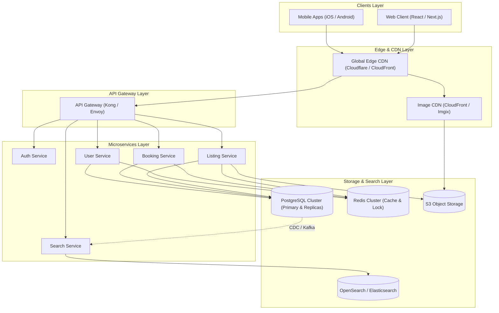

# Production System Architecture — Vacation Rental Marketplace

This document outlines the high-level, production-grade system architecture for a large-scale vacation rental marketplace (e.g., Airbnb) engineered to serve millions of active users with sub-second latency, zero double-bookings, and high availability (99.99%).

---

## 1. High-Level Architecture Diagram

---

## 2. Frontend Layer

- **Global Edge CDN (Cloudflare / AWS CloudFront)**:
  - Serves static assets (JS, CSS, fonts) from 300+ edge locations worldwide.
  - Handles DDoS protection, Web Application Firewall (WAF), and SSL/TLS termination.
- **React / Next.js Web App**:
  - Uses Server-Side Rendering (SSR) for dynamic listing pages and Incremental Static Regeneration (ISR) for high-traffic destination pages to maximize SEO and minimize LCP.
- **Image CDN (CloudFront + AWS Lambda@Edge / Imgix)**:
  - Automatically transforms, crops, compresses, and serves responsive images in modern WebP/AVIF formats based on client device capabilities.

---

## 3. Backend Microservices Layer

- **API Gateway (Kong / Envoy)**:
  - Entry point for all client requests.
  - Handles rate limiting, authentication token verification (JWT), request routing, CORS, and TLS termination.
- **Authentication Service**:
  - Manages OAuth2 / OpenID Connect flows, multi-factor authentication (MFA), password hashing (Argon2id), and JWT issuance/revocation.
- **Listing Service**:
  - Manages property details, room categorization, host highlights, house rules, and amenities.
  - Emits property change events to Apache Kafka for downstream search indexing.
- **Booking Service**:
  - Manages reservation workflows, stay duration calculations, pricing rules, and payment gateway integrations (Stripe).
  - Uses distributed locking to guarantee zero double-bookings.
- **User Service**:
  - Manages user profiles, host Superhost qualifications, guest reviews, and wishlist collections.

---

## 4. Search & Discovery Layer

- **Dedicated Search Engine (OpenSearch / Elasticsearch)**:
  - In-memory geospatial indexing (H3 geohashes / GeoJSON polygon queries) enabling real-time map bounds filtering.
  - Full-text search over property titles, descriptions, and amenities.
- **CDC Sync Engine (Debezium + Kafka)**:
  - Real-time Change Data Capture (CDC) streams database writes from PostgreSQL to OpenSearch to maintain index synchronization under 1 second.

---

## 5. Storage & Caching Layer

- **Primary Database (PostgreSQL Cluster)**:
  - Primary node for transactional writes (`SERIALIZABLE` isolation for bookings).
  - Read-Replicas scaled horizontally across Availability Zones to handle a 100:1 read-to-write ratio.
  - Horizontal sharding (via Citus) by `listing_id` or `location_id` for massive horizontal scale.
- **In-Memory Cache & Distributed Lock (Redis Cluster)**:
  - Caches user sessions, property metadata, and pricing configurations.
  - Uses `Redlock` distributed locking algorithm to serialize concurrent booking requests for the same listing and date range.
- **Object Storage (AWS S3 / Google Cloud Storage)**:
  - Encrypted, durable storage for high-resolution property photos uploaded by hosts.

---

## 6. Infrastructure, Reliability & Observability

- **Load Balancing & Auto-scaling**:
  - AWS Application Load Balancer (ALB) distributing traffic across Kubernetes (EKS) node pools.
  - Horizontal Pod Autoscaler (HPA) scaling pods dynamically based on CPU utilization and request throughput (RPS).
- **Monitoring & Metrics**:
  - Prometheus collecting application and infrastructure metrics; Grafana dashboards for real-time visual alerts.
- **Centralized Logging & Distributed Tracing**:
  - Grafana Loki / ELK Stack aggregating structured JSON logs.
  - OpenTelemetry (Jaeger) tracing end-to-end request latency across microservice boundaries.
- **CI/CD Pipeline**:
  - Automated GitHub Actions testing (`npm run lint`, unit/integration tests).
  - ArgoCD executing GitOps progressive Canary deployments.

---

## 7. Scaling to Millions of Users

1. **Read Heavy Optimization**: 99% of requests are read operations (browsing listings). Multi-level caching (Browser -> CDN -> Redis -> Postgres Read Replicas) ensures 95%+ cache hit ratio.
2. **Preventing Double-Bookings**:
   - Step 1: Redis distributed lock (`Redlock`) acquired for `listing_id + checkin + checkout`.
   - Step 2: PostgreSQL transactional row lock (`SELECT ... FOR UPDATE`) verifies slot availability.
   - Step 3: Transaction commits or rolls back atomically.
3. **Global Multi-Region Resilience**:
   - Active-Active multi-region deployment with global database read replicas ensures single-digit millisecond latency worldwide.
